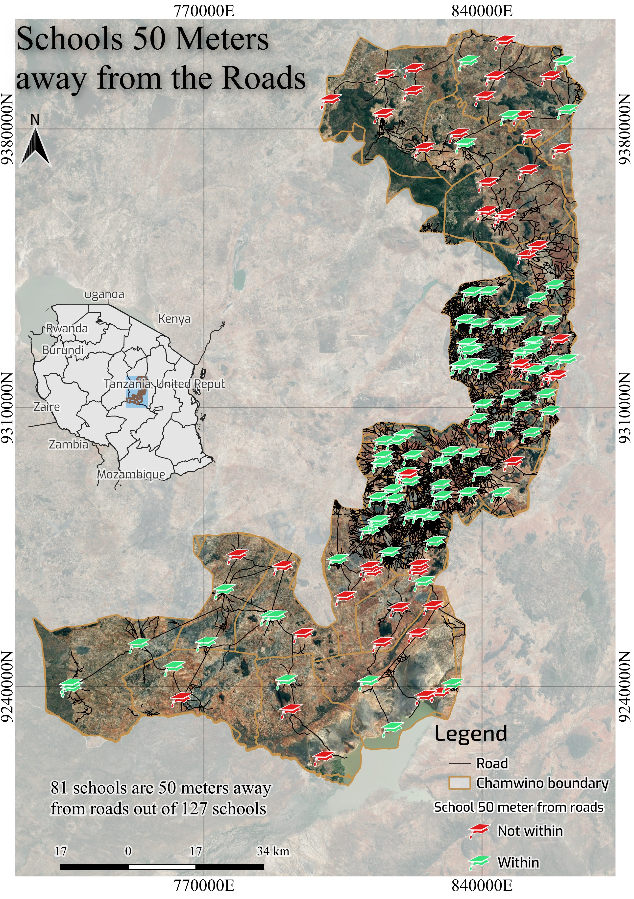

# Week 04. Spatial relationships and analysis

## 1. Question

>How many Schools in Chamwino are 50 meters away from the road?
## 2. Operation

**Select Within Distance**, then I create a new column so as to record the selection
## 3. Expected

I expected all schools to be falling in it due to they are very close to the road.
## 4. Got

**81 schools out of 127 schools** were within 50 meters from the roads.
## 5. What surprised me

The short time to perform a duty which if it was carried manually could use couple of days.
## 6. What I still need

- Buildings as settlements, elevation data so as to have something more meaningful.

## 7. My first map

---

#### GeODav Lab 
LEARN   BUILD   COLLABORATE TRANSFORM 
